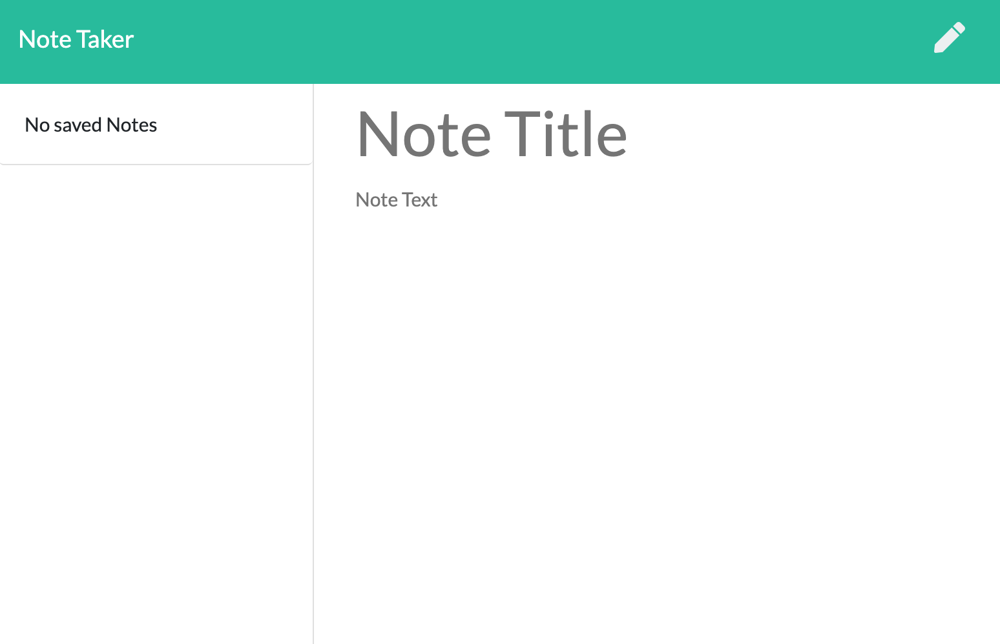

# Note-Taker

## Description
This Note-Taker application was built to allow a user to add notes using a full stack approach. The server code was built using npm express and communicated with the front end using api routes. 



## Table of Contents
* [Installation](#installation)
* [Usage](#usage)
* [Contributing](#contributing)
* [License](#license)
* [Tests](#tests)
* [Questions](#questions)

## Installation
Node modules where used to develop this application. Insomnia Core was used to test apis and the application was deployed to Heroku to run the application.
  
```md
npm init
npm install express
heroku create
Insomnia Core
```

## Usage
To use the application, follow link: https://fierce-woodland-76520.herokuapp.com/ 

## License
This project is licensed under the [MIT](https://choosealicense.com/licenses/mit/) license. Click the link for more information about the license.

## Tests
Before being deployed to Heroku, this application was tested using npm and Insomnia Core.

### Questions
Any questions see the following: 

[email](mailto:XXX@gmail.com)

[Github page]('https://github.com/anthonykieu/note-taker').